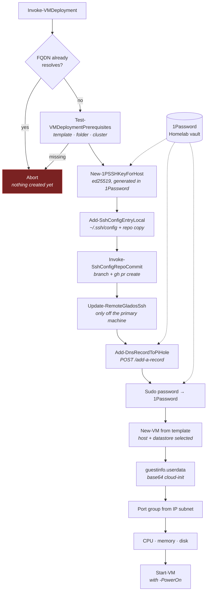

# VMDeployTools

> PowerShell module that provisions a vSphere VM end to end — SSH key, DNS record, cloud-init,
> and SSH config — from a single command.

[](https://github.com/vollminlab/VMDeployTools/actions/workflows/test.yml)


`Invoke-VMDeployment -VMName web01 ...` produces a booted, reachable, key-authenticated VM. It
generates an ed25519 keypair inside 1Password, registers an A record in Pi-hole, clones the
template, injects cloud-init through vSphere `guestinfo` properties, and writes the SSH `Host`
block into both `~/.ssh/config` and the `homelab-infrastructure` repo. `Remove-VMDeployment`
reverses all of it.

The ordering is deliberate: every vCenter precondition is checked **before** the first side effect,
so a typo in a template name costs an error message rather than an orphaned 1Password item, a stale
DNS record, and a half-written SSH config.

---

## How a deployment runs



| # | Step | What actually happens |
|---|---|---|
| 1 | DNS conflict check | `[System.Net.Dns]::GetHostAddresses($fqdn)` — if the FQDN resolves, the command writes an error and returns |
| 2 | vCenter preconditions | Connect to vCenter, then `Get-Template` / `Get-Folder` / `Get-Cluster`. Failure lists the available names in the error |
| 3 | SSH key | `op item create --category "SSH Key" --ssh-generate-key ed25519`, titled `{VMName}_id_ed25519`. Public key written to `~/.ssh/{VMName}_id_ed25519.pub`; the private key never touches disk |
| 4 | SSH config | `Host` block appended to `~/.ssh/config` and to `hosts/windows/ssh/config` in `homelab-infrastructure` |
| 5 | Config repo PR | Branch `chore/ssh-config-add-{vmname}`, commit, push, `gh pr create` |
| 6 | Remote mirror | Only when `$env:COMPUTERNAME` differs from `LocalMachineName` — copies the `.pub` and appends the `Host` block over the UNC share |
| 7 | DNS record | `POST /add-a-record` to the Pi-hole API with the bearer token from 1Password |
| 8 | Sudo password | 24-character random password saved as a 1Password login item titled `{VMName}` |
| 9 | Placement | `Test-VMHostReadiness`, then datastore selection, then the connected host with the lowest `CpuUsageMhz` |
| 10 | Clone | `New-VM` from the template into the folder, on resource pool `Resources` |
| 11 | cloud-init | Four `guestinfo` advanced settings injected: `userdata`, `userdata.encoding`, `metadata`, `metadata.encoding` |
| 12 | Network | Port group derived from the IP's third octet, applied with `Set-NetworkAdapter` |
| 13 | Hardware | `-CPU` / `-MemoryGB` applied; `-DiskGB` **grows only** — a smaller value is logged and skipped |
| 14 | Power on | `Start-VM`, only with `-PowerOn` |

Steps 4–8 are irreversible-ish side effects, which is why steps 1–2 exist. Everything after step 2
degrades rather than aborts: a failed repo commit, remote mirror, DNS call, or port-group
assignment logs a warning and the deployment continues.

### Placement rules

`Install-VirtualMachine` needs `DiskGB × 1.1` of free space, or 30 GB if `-DiskGB` is omitted. It
first looks for a datastore named in `PreferredDatastores` with that much free space, taking the
emptiest one, and pairs it with the least-busy connected host. If no preferred datastore qualifies,
it walks the connected hosts and takes the first one whose own local datastore has room — so the
storage decision constrains the host choice, not the other way round.

### What cloud-init receives

The user-data payload is generated per VM and base64-encoded into `guestinfo.userdata`:

- User `vollmin`, `sudo: ALL=(ALL) ALL` — **sudo requires the password**, it is not NOPASSWD
- The generated public key in `ssh_authorized_keys`, and `ssh_pwauth: false`
- The same password as a SHA-512 crypt hash in `passwd`, plus a `chpasswd` entry that does not expire
- Netplan `50-cloud-init.yaml` matching `en*`, address `{IPAddress}/24`, nameservers
  `192.168.100.4` and `192.168.100.3`, default route via `{first-three-octets}.1`
- cloud-init's own network config disabled via `99-disable-network-config.cfg`, then `netplan apply`

Two assumptions are baked in and are not configurable: **/24 prefix** and **gateway at `.1`**. A VM
on a differently-sized subnet, or one whose gateway is not the first host address, will boot with
the wrong network configuration.

### Port group selection

`Get-NetworkPortGroupFromIP` lists distributed port groups matching `^\d{3}-DPG-` and picks the one
whose prefix equals the IP's third octet. If nothing matches, it falls back to a hardcoded map:

| Subnet | Port group |
|---|---|
| `192.168.152.x` | `152-DPG-GuestNet` |
| `192.168.160.x` | `160-DPG-DMZ` |
| anything else | throws |

Naming a new port group `NNN-DPG-<something>` is enough to make it discoverable — no code change.

---

## Requirements

| Requirement | Why |
|---|---|
| Windows PowerShell 5.1+ | Manifest declares `PowerShellVersion = '5.1'`. The module is Windows-only in practice: it reads `\\.\pipe\openssh-ssh-agent`, uses `$env:COMPUTERNAME`, and joins paths with `\` |
| [VMware PowerCLI](https://developer.vmware.com/powercli) | Installed automatically from PSGallery on first `Connect-ToVCenter` if absent. No version is pinned or declared in the manifest |
| [1Password CLI](https://developer.1password.com/docs/cli/) `op` | All credentials, key generation, and the config bootstrap |
| 1Password desktop app with the SSH agent enabled | Serves the private key at SSH time. `Test-1PasswordSSHAgent` checks for the named pipe |
| `git` | Sibling-repo discovery and the SSH config commit |
| `gh` | Opens the SSH config PR. Without it the branch is still pushed and the branch name is logged |
| Reachable vCenter and Pi-hole API | Deployment and DNS |

## Installation

```powershell
git clone https://github.com/vollminlab/VMDeployTools
git clone https://github.com/vollminlab/homelab-infrastructure  # sibling repo, same parent dir
Import-Module .\VMDeployTools\VMDeployTools.psd1
```

On first import, if `VMDeployTools.config.psd1` is absent the module reads the secure note
`VMDeployTools Config` from 1Password and writes the file itself — running `op signin` if no
session exists. Nothing to edit by hand on a fresh machine.

Two details worth knowing about that bootstrap:

- The vault is **hardcoded to `Homelab`** for this one call, because `VaultName` is what the note
  is being fetched to discover.
- The note body is read from the `notesPlain` field and written verbatim, so it must be a valid
  PowerShell data file — the same hashtable shape as `VMDeployTools.config.example.psd1`.

The config lands next to the module as `VMDeployTools.config.psd1`, which is gitignored.

### Manual config

```powershell
Copy-Item VMDeployTools.config.example.psd1 VMDeployTools.config.psd1
# then edit it
```

## Configuration

Every key is required; the module reads them all at import and has no fallback defaults.

| Key | Purpose |
|---|---|
| `VaultName` | 1Password vault used for every runtime lookup |
| `SvcTokenItemTitle` | Item holding the service account token, read from its `password` field |
| `VCenterCredItemTitle` | Item holding vCenter credentials, fields `username` and `password` |
| `LocalMachineName` | Compared case-insensitively against `$env:COMPUTERNAME`. On a match, the remote SSH mirror is skipped |
| `RemoteUserProfileShare` | UNC path to the `.ssh` directory on the other admin machine. Empty string disables mirroring |
| `VCenterServer` | vCenter hostname or IP |
| `ClusterName` | vCenter cluster to deploy into |
| `PreferredDatastores` | Array of shared datastore names preferred over host-local storage |
| `Domain` | Appended to `VMName` to form the FQDN |
| `PiHoleServer` | Pi-hole API host — use the keepalived VRRP VIP, not an individual node |
| `PiHolePort` | Pi-hole API port, as a string |

There is no `SshConfigRepoPath` key. At the end of module load, `Find-SiblingRepo` reads this
repo's own `origin` URL, extracts the GitHub owner, and scans sibling directories for a repo whose
`origin` is `<owner>/homelab-infrastructure`. If none is found the module warns and simply skips
every infra-repo write.

## 1Password

`Initialize-OpAuth` is lazy — nothing is fetched at import. On the first operation it reads the
service account token and sets `OP_SERVICE_ACCOUNT_TOKEN` for the **current process only**, then
memoizes so later calls are free. `Clear-OpAuth`, or the `-ClearOpAuthToken` switch on either main
command, removes it again.

| Item | Field(s) | Role |
|---|---|---|
| `VMDeployTools Config` | `notesPlain` | Config bootstrap. Vault is hardcoded to `Homelab` |
| *`SvcTokenItemTitle`* | `password` | Service account token for headless `op` calls |
| *`VCenterCredItemTitle`* | `username`, `password` | vCenter login |
| `Recordimporter` | `credential` | Pi-hole API bearer token. **The item title is hardcoded**, only the vault is configurable |
| `{VMName}_id_ed25519` | `public key` | Created per VM, category `SSH Key`, tags `Homelab,AutoProvisioned` |
| `{VMName}` | `username`, `password` | Created per VM, category `login`, tag `Homelab`, username `vollmin` |

`New-1PSSHKeyForHost` looks the key up with `op item list ... --categories "SSH Key"` rather than
`op item get`, because `op item get` errors out on duplicate titles. If duplicates exist it warns,
uses the most recently updated one, and continues — a failed retry never wedges the next attempt.
An existing key is reused as-is, so re-running a deployment does not rotate credentials.

On teardown both per-VM items are `--archive`d, never deleted. They are recoverable from the
1Password archive.

## Pi-hole DNS

DNS goes through [`pihole-flask-api`](https://github.com/vollminlab/pihole-flask-api), a Flask
service on the Pi-hole hosts that edits `pihole.toml` directly.

| Operation | Request | Body |
|---|---|---|
| `Add-DnsRecordToPiHole` | `POST http://{PiHoleServer}:{PiHolePort}/add-a-record` | `{"domain": "<fqdn>", "ip": "<ip>"}` |
| `Remove-DnsRecordFromPiHole` | `DELETE http://{PiHoleServer}:{PiHolePort}/delete-a-record` | `{"domain": "<fqdn>"}` |

Both send `Authorization: Bearer <token>`. Only A records are used; the API's CNAME endpoints are
not called from here.

`PiHoleServer` must be the VRRP VIP rather than `pihole1` or `pihole2`. There is exactly one
request and no failover logic — pointing at a specific node means DNS registration breaks whenever
that node is the one down.

Neither operation is fatal. An add failure or a delete failure is logged and warned about, and the
deployment or teardown continues.

## SSH config sync

The `Host` block is appended to `~/.ssh/config` and to `hosts/windows/ssh/config` in
`homelab-infrastructure`, guarded by a `^Host <name>$` match so re-runs never duplicate it:

```
Host web01
  HostName web01.vollminlab.com
  User vollmin
  IdentityFile ~/.ssh/web01_id_ed25519.pub
```

Two things about that block are easy to get wrong:

- **`IdentityFile` is always rewritten to `~/.ssh/<filename>`**, never the absolute Windows path
  the key was written to. The same file is consumed on Linux and macOS, where a `C:\Users\...`
  path is meaningless.
- **There is no per-host `IdentitiesOnly yes`.** The repo's config sets it once in the global
  `Host *` block; repeating it per host was removed as redundant noise.

`Invoke-SshConfigRepoCommit` does not push to `main` — `main` is protection-enforced and a direct
push fails. It creates `chore/ssh-config-{add|remove}-{vmname}`, commits, pushes with `-u origin`,
and opens a PR with `gh pr create`, then returns the working tree to `main`. If `gh` is missing or
fails, the branch is left pushed and its name is logged for a manual PR. **The SSH config in the
infra repo is therefore not updated until that PR is merged** — the local `~/.ssh/config` is
current immediately, the shared copy is not.

Every failure path in this function checks out `main` again, including the no-op case where the
entry already existed, which also deletes the throwaway branch.

## Usage

### Deploy

```powershell
Invoke-VMDeployment -VMName "webserver01" `
                    -TemplateName "Ubuntu-24.04-Template" `
                    -IPAddress "192.168.152.100" `
                    -VMFolder "Linux VMs" `
                    -CPU 4 -MemoryGB 8 -DiskGB 50 `
                    -PowerOn
```

| Parameter | Required | Notes |
|---|---|---|
| `-VMName` | yes | Also the hostname, the SSH `Host` alias, and both 1Password item titles |
| `-TemplateName` | yes | vCenter template name, case-sensitive |
| `-IPAddress` | yes | Static address; determines both the port group and the gateway |
| `-VMFolder` | yes | vCenter VM folder |
| `-CPU` | no | `Set-VM -NumCpu` |
| `-MemoryGB` | no | `Set-VM -MemoryGB` |
| `-DiskGB` | no | Grows the first disk only; shrink requests are logged and ignored |
| `-PowerOn` | no | Without it, the VM is left off and cloud-init has not run |
| `-ClearOpAuthToken` | no | Drops `OP_SERVICE_ACCOUNT_TOKEN` when the command finishes |

### Remove

```powershell
Remove-VMDeployment -VMName "webserver01"
```

Takes `-VMName` and `-ClearOpAuthToken`. In order: Pi-hole A record, local public key, local
`Host` block, infra-repo `Host` block plus a removal PR, local `known_hosts` entries for both the
short name and the FQDN, the same three artifacts on the remote share, both 1Password items
archived, then `Stop-VM` and `Remove-VM -DeletePermanently`. Every stage is wrapped so a failure
warns and the teardown continues — the VM always gets deleted.

`ConfirmImpact` is `High`, so this prompts unless you pass `-Confirm:$false`.

### Preview

```powershell
Invoke-VMDeployment -VMName "testvm" -TemplateName "Ubuntu-24.04-Template" `
    -IPAddress "192.168.152.100" -VMFolder "Linux VMs" -PowerOn -WhatIf

Remove-VMDeployment -VMName "testvm" -WhatIf
```

`Invoke-VMDeployment -WhatIf` still performs the DNS conflict check for real before printing its
plan — it is the one step that runs either way.

## Exported functions

### Orchestration

| Function | Purpose |
|---|---|
| `Invoke-VMDeployment` | Full deployment |
| `Remove-VMDeployment` | Full teardown |

### vCenter

| Function | Purpose |
|---|---|
| `Connect-ToVCenter` | Connect with 1Password credentials; installs and imports PowerCLI, sets `-InvalidCertificateAction Ignore` for the session |
| `Test-VMDeploymentPrerequisites` | `-VMName`, `-TemplateName`, `-VMFolder` — validates template, folder, and the configured cluster |
| `Test-VMHostReadiness` | `-ClusterName`, `-VMName` — requires at least one `Connected` host; logs free CPU and memory per host |
| `Install-VirtualMachine` | The clone-and-configure worker; takes `-GuestPassword` as a `[ref]` to hand the generated password back |

### DNS

| Function | Purpose |
|---|---|
| `Add-DnsRecordToPiHole` | `-Fqdn`, `-IPAddress` |
| `Remove-DnsRecordFromPiHole` | `-Fqdn` |

### SSH

| Function | Purpose |
|---|---|
| `New-1PSSHKeyForHost` | `-HostName` — creates or reuses the key; returns `Title`, `PublicKeyText`, `PublicKeyPathLocal` |
| `Add-SshConfigEntryLocal` | `-HostName`, `-DnsName`, `-PublicKeyPath`, `-ConfigPaths` — defaults to `~/.ssh/config` |
| `Update-RemoteGladosSsh` | `-HostName`, `-DnsName`, `-PublicKeyText`, `-PublicKeyFileName` — returns `$false` if the share is unreachable |
| `Invoke-SshConfigRepoCommit` | `-VMName`, `-Action` with `add` or `remove` — branch, commit, push, PR |

### 1Password

| Function | Purpose |
|---|---|
| `Initialize-OpAuth` | Ensure the service account token is loaded for this process |
| `Clear-OpAuth` | Remove it again |
| `Save-SudoPasswordTo1Password` | `-VMName`, `-SecurePassword`, `-Vault` — creates or edits the login item |

### Utilities

| Function | Purpose |
|---|---|
| `Find-SiblingRepo` | `-RepoName`, `-RelativePath` — locate a sibling repo by GitHub owner |
| `Test-1PasswordSSHAgent` | Throws if the agent pipe is absent; warns if 1Password is not running |

## Logging

Every operation appends to `.\logs\{VMName}.log`, relative to the **current working directory**,
not the module directory. Milestone lines also print to the console; the rest appear only under
`-Verbose`.

```
[2026-04-05 21:52:15] Invoke-VMDeployment START Template=Ubuntu-Template,IP=192.168.152.3,Folder=Linux VMs,PowerOn=True
[2026-04-05 21:52:15] Validating vCenter prerequisites (template, folder, cluster)...
[2026-04-05 21:52:15] Loading VMware PowerCLI module...
[2026-04-05 21:52:15] Already connected to vCenter vcenter.vollminlab.com.
[2026-04-05 21:52:15] Checking template 'Ubuntu-Template'...
[2026-04-05 21:52:15] vCenter prerequisites validated.
[2026-04-05 21:52:40] New-VM succeeded
[2026-04-05 21:52:56] VM powered on
[2026-04-05 21:52:57] Invoke-VMDeployment COMPLETE
```

## Disaster recovery

```powershell
# 1. Install the 1Password CLI and the desktop app, with the SSH agent enabled
# 2. Clone both repos into the same parent directory
git clone https://github.com/vollminlab/VMDeployTools
git clone https://github.com/vollminlab/homelab-infrastructure

# 3. Import — the config bootstraps from 1Password, the infra repo is auto-discovered
Import-Module .\VMDeployTools\VMDeployTools.psd1

# 4. Restore the public keys and SSH config from the infra repo
Copy-Item homelab-infrastructure\hosts\windows\ssh\*.pub ~\.ssh\
Copy-Item homelab-infrastructure\hosts\windows\ssh\config ~\.ssh\config
```

The `VMDeployTools Config` secure note is the source of truth for configuration. Update it when the
infrastructure changes — a new vCenter, a new Pi-hole VIP — because a rebuilt machine reads the
note, not this repo.

## Testing

Pester 5 unit tests live in `tests/VMDeployTools.Unit.Tests.ps1` and cover the logic that runs
without a cluster: `Find-SiblingRepo` URL parsing, `Remove-HostBlockFromConfig`,
`Remove-HostFromKnownHosts`, `ConvertTo-SHA512Crypt`, `Add-SshConfigEntryLocal` idempotency, and
the `Get-NetworkPortGroupFromIP` fallback map.

```powershell
Copy-Item .\VMDeployTools.config.example.psd1 .\VMDeployTools.config.psd1  # import needs a config
Invoke-Pester -Path .\tests -Tag Unit
```

CI runs the same suite on `windows-latest` via `.github/workflows/test.yml`. The job is named
**Pester Unit Tests**, which is the exact string `github-admin` requires as a status check on
`main` — renaming the job breaks branch protection for this repo.

## Troubleshooting

**Config file missing on a new machine.** Import the module; it prompts for 1Password auth and
writes the config. Without `op`, copy `VMDeployTools.config.example.psd1` by hand.

**`homelab-infrastructure repo not found as a sibling of this repo`.** Both repos must sit in the
same parent directory and have the same GitHub owner in their `origin` URL. The deployment still
works; only the infra-repo copy of the SSH config is skipped.

**Template or folder not found.** The error lists the available names:

```
Template 'Ubuntu-24.04-Template' not found in vCenter. Available templates: Ubuntu-22.04-Template, Windows-2022-Template
```

**Duplicate SSH keys in 1Password.** The module warns, uses the newest, and carries on. Clean up:

```powershell
op item list --vault Homelab --categories "SSH Key" --format json | ConvertFrom-Json |
    Where-Object title -eq "hostname_id_ed25519"
# then: op item delete <id> --vault Homelab
```

**Pi-hole DNS not updating.** The API exposes only the four record endpoints, so a bare `GET /`
returns 404 rather than proving anything. Test the real path:

```powershell
$token = op item get "Recordimporter" --vault Homelab --field credential --reveal
Invoke-RestMethod -Uri "http://192.168.100.4:5001/add-a-record" -Method Post `
  -Headers @{ Authorization = "Bearer $token"; "Content-Type" = "application/json" } `
  -Body '{"domain":"probe.vollminlab.com","ip":"192.168.152.254"}'
```

If it times out, check which Pi-hole node currently holds the keepalived VIP.

**SSH config PR never appeared.** Look for `branch pushed as 'chore/ssh-config-...'` in the VM log
— that means `gh` was missing or unauthenticated, and the branch is waiting for a manual PR.

**1Password auth issues.**

```powershell
Clear-OpAuth
Initialize-OpAuth
```

**SSH agent not working.**

```powershell
Test-1PasswordSSHAgent
```

## License

MIT — see [LICENSE](LICENSE).
